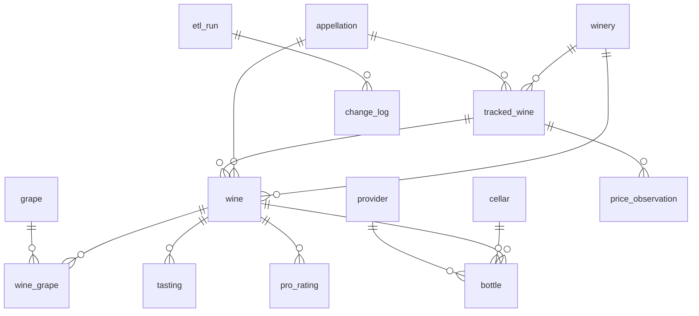

# Entity Model

14 entities stored as Parquet files. Every entity row carries `etl_run_id` (int32) and `updated_at` (timestamp µs) metadata columns.

## Entity Relationship Diagram



## Entity Summary

### Core — Cellar Domain

Lookup entities, the central wine catalogue, and related detail tables. Sourced from cellarbrain CSV exports.

| Entity | PK | Natural Key | Soft-Delete | Cols |
|--------|-----|-------------|-------------|------|
| winery | `winery_id` | `name` | No | 4 |
| appellation | `appellation_id` | `country, region, subregion, classification` | No | 7 |
| grape | `grape_id` | `name` | No | 4 |
| cellar | `cellar_id` | `name` | No | 5 |
| provider | `provider_id` | `name` | No | 4 |
| wine | `wine_id` | `winery_id, name, vintage, is_non_vintage` | **Yes** | 52 |
| wine_grape | *(composite)* | `wine_id, grape_id` | No | 6 |
| bottle | `bottle_id` | `wine_id, cellar_id, shelf, bottle_number, purchase_date, provider_id, status, output_date` | No | 21 |
| tasting | `tasting_id` | `wine_id, tasting_date` | No | 8 |
| pro_rating | `rating_id` | `wine_id, source, score` | No | 8 |

### Tracking & Pricing

Cross-vintage wine identity and price observations. `tracked_wine` groups per-vintage wines; `price_observation` stores retailer price snapshots.

| Entity | PK | Natural Key | Soft-Delete | Cols |
|--------|-----|-------------|-------------|------|
| tracked_wine | `tracked_wine_id` | `winery_id, wine_name` | **Yes** | 9 |
| price_observation | `observation_id` | — | No | 13 |

### System — ETL Pipeline

Append-only tables recording pipeline runs and per-entity changes.

| Entity | PK | Natural Key | Soft-Delete | Cols |
|--------|-----|-------------|-------------|------|
| etl_run | `run_id` | — | No | 10 |
| change_log | `change_id` | — | No | 6 |

**Total: 14 entities, 157 columns.**

## Soft-Delete Semantics

`wine` and `tracked_wine` use soft deletes. When a wine disappears from the CSV export:
- The row is retained with `is_deleted = true` (tombstone).
- It is excluded from all DuckDB views and FK validation.
- If the wine reappears in a future export, it is **revived** (`is_deleted` set back to `false`).
- Tombstones are carried forward across both sync and full-load runs.
- When a wine's winery or name changes in the Vinocell app, **rename detection** pairs the unmatched NEW + DELETED wines by vintage and preserves the old `wine_id` (see [ADR-009](decisions/009-slug-based-wine-id-stabilisation.md)).

## Wine ID Stabilisation

Wine IDs are stabilised via **slug-based pre-matching** before the transform step. A deterministic slug is computed from raw CSV fields `(Winery, Name, Year)` and matched against the `wine_slug` column in existing `wine.parquet`. This runs in both full-load and sync modes, making wine IDs stable regardless of CSV row ordering. See [ADR-009](decisions/009-slug-based-wine-id-stabilisation.md) for the full design.

The natural key `(winery_id, name, vintage, is_non_vintage)` is still used for downstream entity joins (bottles, tastings, ratings) but is **not** used for wine ID assignment.

## ID Ranges

- Lookup entities (winery, appellation, grape, cellar, provider): sequential from 1.
- Core entities (wine, bottle, tasting, pro_rating): sequential from 1.
- `tracked_wine`: IDs start at offset **90,001** (`TRACKED_WINE_ID_OFFSET`).
- `etl_run` and `change_log`: append-only, IDs continue from max existing.

## Entity Processing Order

Entities are processed in dependency order during incremental sync:

```
winery → appellation → grape → cellar → provider → tracked_wine → wine → wine_grape → bottle → tasting → pro_rating
```

Lookups stabilised first so that FK columns in downstream entities can be remapped.

## FK References

**Core**

| Entity | FK Column | References |
|--------|-----------|------------|
| wine | `winery_id` | winery |
| wine | `appellation_id` | appellation |
| wine | `tracked_wine_id` | tracked_wine |
| wine_grape | `wine_id` | wine |
| wine_grape | `grape_id` | grape |
| bottle | `wine_id` | wine |
| bottle | `cellar_id` | cellar |
| bottle | `provider_id` | provider |
| tasting | `wine_id` | wine |
| pro_rating | `wine_id` | wine |

**Tracking & Pricing**

| Entity | FK Column | References |
|--------|-----------|------------|
| tracked_wine | `winery_id` | winery |
| tracked_wine | `appellation_id` | appellation |
| price_observation | `tracked_wine_id` | tracked_wine |

**System**

| Entity | FK Column | References |
|--------|-----------|------------|
| change_log | `run_id` | etl_run |

---

## Per-Entity Schemas

Column definitions from `writer.SCHEMAS`. Nullable = True means the column allows NULL.

### Core — Cellar Domain

#### winery

| Column | Type | Nullable |
|--------|------|----------|
| winery_id | int32 | No |
| name | string | No |
| etl_run_id | int32 | No |
| updated_at | timestamp(µs) | No |

#### appellation

| Column | Type | Nullable |
|--------|------|----------|
| appellation_id | int32 | No |
| country | string | No |
| region | string | Yes |
| subregion | string | Yes |
| classification | string | Yes |
| etl_run_id | int32 | No |
| updated_at | timestamp(µs) | No |

#### grape

| Column | Type | Nullable |
|--------|------|----------|
| grape_id | int32 | No |
| name | string | No |
| etl_run_id | int32 | No |
| updated_at | timestamp(µs) | No |

#### cellar

| Column | Type | Nullable |
|--------|------|----------|
| cellar_id | int32 | No |
| name | string | No |
| sort_order | int8 | No |
| etl_run_id | int32 | No |
| updated_at | timestamp(µs) | No |

#### provider

| Column | Type | Nullable |
|--------|------|----------|
| provider_id | int32 | No |
| name | string | No |
| etl_run_id | int32 | No |
| updated_at | timestamp(µs) | No |

#### wine

| Column | Type | Nullable |
|--------|------|----------|
| wine_id | int32 | No |
| wine_slug | string | No |
| winery_id | int32 | Yes |
| name | string | Yes |
| vintage | int16 | Yes |
| is_non_vintage | bool | No |
| appellation_id | int32 | Yes |
| category | string | No |
| _raw_classification | string | Yes |
| subcategory | string | Yes |
| specialty | string | Yes |
| sweetness | string | Yes |
| effervescence | string | Yes |
| volume_ml | int16 | No |
| _raw_volume | string | Yes |
| container | string | Yes |
| hue | string | Yes |
| cork | string | Yes |
| alcohol_pct | float32 | Yes |
| acidity_g_l | float32 | Yes |
| sugar_g_l | float32 | Yes |
| ageing_type | string | Yes |
| ageing_months | int16 | Yes |
| farming_type | string | Yes |
| serving_temp_c | int8 | Yes |
| opening_type | string | Yes |
| opening_minutes | int16 | Yes |
| drink_from | int16 | Yes |
| drink_until | int16 | Yes |
| optimal_from | int16 | Yes |
| optimal_until | int16 | Yes |
| original_list_price | decimal128(8,2) | Yes |
| original_list_currency | string | Yes |
| list_price | decimal128(8,2) | Yes |
| list_currency | string | Yes |
| comment | string | Yes |
| winemaking_notes | string | Yes |
| is_favorite | bool | No |
| is_wishlist | bool | No |
| tracked_wine_id | int32 | Yes |
| full_name | string | No |
| grape_type | string | No |
| primary_grape | string | Yes |
| grape_summary | string | Yes |
| _raw_grapes | string | Yes |
| dossier_path | string | No |
| drinking_status | string | No |
| age_years | int16 | Yes |
| price_tier | string | No |
| bottle_format | string | No |
| price_per_750ml | decimal(8,2) | Yes |
| format_group_id | int32 | Yes |
| is_deleted | bool | No |
| etl_run_id | int32 | No |
| updated_at | timestamp(µs) | No |

`format_group_id` links wines that share the same identity (winery, name, vintage) but differ in bottle volume (e.g. Standard 750 mL and Magnum 1500 mL). The value is the `wine_id` of the Standard (or smallest) variant. `NULL` when the wine has no format siblings.

#### wine_grape

| Column | Type | Nullable |
|--------|------|----------|
| wine_id | int32 | No |
| grape_id | int32 | No |
| percentage | float32 | Yes |
| sort_order | int8 | No |
| etl_run_id | int32 | No |
| updated_at | timestamp(µs) | No |

#### bottle

| Column | Type | Nullable |
|--------|------|----------|
| bottle_id | int32 | No |
| wine_id | int32 | No |
| status | string | No |
| cellar_id | int32 | Yes |
| shelf | string | Yes |
| bottle_number | int16 | Yes |
| provider_id | int32 | Yes |
| purchase_date | date32 | No |
| acquisition_type | string | No |
| original_purchase_price | decimal128(8,2) | Yes |
| original_purchase_currency | string | No |
| purchase_price | decimal128(8,2) | Yes |
| purchase_currency | string | No |
| purchase_comment | string | Yes |
| output_date | date32 | Yes |
| output_type | string | Yes |
| output_comment | string | Yes |
| is_onsite | bool | No |
| is_in_transit | bool | No |
| etl_run_id | int32 | No |
| updated_at | timestamp(µs) | No |

#### tasting

| Column | Type | Nullable |
|--------|------|----------|
| tasting_id | int32 | No |
| wine_id | int32 | No |
| tasting_date | date32 | No |
| note | string | Yes |
| score | float32 | Yes |
| max_score | int16 | Yes |
| etl_run_id | int32 | No |
| updated_at | timestamp(µs) | No |

#### pro_rating

| Column | Type | Nullable |
|--------|------|----------|
| rating_id | int32 | No |
| wine_id | int32 | No |
| source | string | No |
| score | float32 | No |
| max_score | int16 | No |
| review_text | string | Yes |
| etl_run_id | int32 | No |
| updated_at | timestamp(µs) | No |

### Tracking & Pricing

#### tracked_wine

| Column | Type | Nullable |
|--------|------|----------|
| tracked_wine_id | int32 | No |
| winery_id | int32 | No |
| wine_name | string | No |
| category | string | No |
| appellation_id | int32 | Yes |
| dossier_path | string | No |
| is_deleted | bool | No |
| etl_run_id | int32 | No |
| updated_at | timestamp(µs) | No |

#### price_observation

Year-partitioned: files stored as `price_observation_YYYY.parquet`.

| Column | Type | Nullable |
|--------|------|----------|
| observation_id | int32 | No |
| tracked_wine_id | int32 | No |
| vintage | int16 | Yes |
| bottle_size_ml | int16 | No |
| retailer_name | string | No |
| retailer_url | string | Yes |
| price | decimal128(8,2) | No |
| currency | string | No |
| price_chf | decimal128(8,2) | Yes |
| in_stock | bool | No |
| observed_at | timestamp(µs) | No |
| observation_source | string | No |
| notes | string | Yes |

### System — ETL Pipeline

#### etl_run

| Column | Type | Nullable |
|--------|------|----------|
| run_id | int32 | No |
| started_at | timestamp(µs) | No |
| finished_at | timestamp(µs) | No |
| run_type | string | No |
| wines_source_hash | string | No |
| bottles_source_hash | string | No |
| bottles_gone_source_hash | string | Yes |
| total_inserts | int32 | No |
| total_updates | int32 | No |
| total_deletes | int32 | No |
| wines_inserted | int32 | No |
| wines_updated | int32 | No |
| wines_deleted | int32 | No |
| wines_renamed | int32 | No |

#### change_log

| Column | Type | Nullable |
|--------|------|----------|
| change_id | int32 | No |
| run_id | int32 | No |
| entity_type | string | No |
| entity_id | int32 | Yes |
| change_type | string | No |
| changed_fields | string | Yes |

## Domain Value Constraints

| Column | Allowed Values |
|--------|---------------|
| `wine.category` | `red`, `white`, `rose`, `sparkling`, `dessert`, `fortified` |
| `bottle.status` | `stored`, `drunk`, `offered`, `removed` |
| `bottle.acquisition_type` | `market_price`, `discount_price`, `present`, `free` |
| `bottle.output_type` | `drunk`, `offered`, `removed` |
| `wine.drinking_status` | `too_young`, `drinkable`, `optimal`, `past_optimal`, `past_window`, `unknown` |
| `wine.grape_type` | `varietal`, `blend`, `unknown` |
| `wine.price_tier` | `budget`, `everyday`, `premium`, `fine`, `unknown` |
| `change_log.change_type` | `insert`, `update`, `delete`, `rename` |
| `etl_run.run_type` | `full`, `incremental` |
